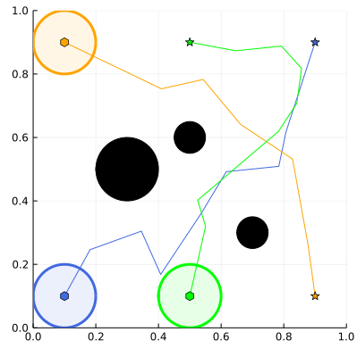
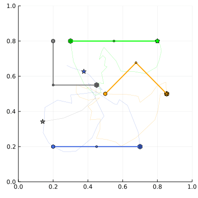

MRMP
===
[](LICENCE.txt)
[](https://github.com/Kei18/mrmp/actions/workflows/ci.yaml)

A private research repo for multi-robot motion planning (MRMP), written in Julia (≥v1.6), tested on MacOS-10.15.

## TODO
- [ ] setup configurations of ablation studies
    - [x] drop h-value
    - [x] drop initial roadmap
- [x] documentation
- [ ] hypra search
  - [ ] baselines
    - [x] point2d
    - [x] point3d
    - [x] line2d
    - [x] arm22
    - [x] arm33
    - [x] dubins2d
    - [x] snake2d
    - [ ] point2d (scalability)
  - [ ] proposal
    - [x] point2d
    - [ ] point3d
    - [ ] line2d
    - [ ] arm22
    - [ ] arm33
    - [ ] snake2d
    - [ ] dubins2d
    - [ ] point2d (scalability)
  - [ ] scalability test
  - [ ] ablation study (point2d, snake2d)
  - [ ] robot demo

## Demo




## Setup

```sh
git clone https://github.com/Kei18/mrmp.git
cd mrmp
julia --project=. -e 'using Pkg; Pkg.instantiate()'
```

## Usage

#### Open JupyterLab

```sh
julia --project=. -e "using IJulia; jupyterlab()"
```

#### Test
```sh
julia --project -e 'using Pkg; Pkg.test()'
```

#### Format
```sh
julia --project=. -e 'using JuliaFormatter; format(".")'
```

#### Hyperparameter Optimization with [Hyperopt.jl](https://github.com/baggepinnen/Hyperopt.jl)
```sh
julia --project=. --threads=auto
> include("./scripts/hypraopt.jl")
> @time main("./scripts/config/hypra/params.yaml", "./scripts/config/eval/point2d.yaml")
```

#### Evaluate Algorithms

```sh
julia --project=. --threads=auto
> include("./scripts/eval.jl")
> @time main("./scripts/config/eval/point2d.yaml", "time_limit=300")
```

The script is inspired by [Hydra](https://hydra.cc/).

#### Scalability Test
```sh
julia --project=. --threads=auto
> include("./scripts/eval.jl")
> @time foreach(N -> main("./scripts/config/eval/point2d_many.yaml", "instance.N=$N"), 10:10:50)
```

#### Ablation Study
```sh
julia --project=. --threads=auto
> include("./scripts/eval.jl")
> @time main("./scripts/config/eval/point2d_ablation.yaml")
> @time main("./scripts/config/eval/arm22_ablation.yaml")
```

## Licence
This software is released under the MIT License, see [LICENSE.txt](LICENCE.txt).

## Author
[Keisuke Okumura](https://kei18.github.io) is a Ph.D. student at the Tokyo Institute of Technology, interested in controlling multiple moving agents.

## Reference
