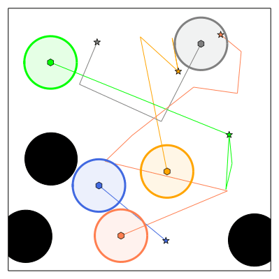

sssp
===
[](LICENCE.txt)
[](https://github.com/Kei18/sssp/actions/workflows/ci.yaml)

The code repository of the paper "[Quick Multi-Robot Motion Planning by Combining Sampling and Search](https://kei18.github.io/sssp/)" (SSSP).


- It is written in Julia (≥v1.6) and tested on MacOS-10.15.
- The accompanied solvers are PRM [1], RRT [2], RRT-Connect [3], PP (PRM-based) [4], CBS (PRM-based) [5], and SSSP.

Please cite the following paper if you use the code in your published research:

```
@article{okumura2022sssp,
  title={Quick Multi-Robot Motion Planning by Combining Sampling and Search},
  author={Okumura, Keisuke and D{\'e}fago, Xavier},
  journal={arXiv preprint},
  year={2022}
}
```

## Setup

```sh
git clone https://github.com/Kei18/sssp.git && cd sssp
julia --project=. -e 'using Pkg; Pkg.instantiate()'
```

## Minimum Example

Here, I give a minimal example of the MRMP library. You can implement the below with RELP or JupyterLab.

#### Enter RELP
```sh
julia --project=.
```

#### Open JupyterLab

```sh
julia --project=. -e "using IJulia; jupyterlab()"
```

### Step 1. Generate Instance
```jl
using MRMP
ins = MRMP.gen_random_instance_StatePoint2D(;
    N = 5,
    rad = 0.1,
    num_obs = 3,
    rad_obs = 0.1,
)
config_init, config_goal, obstacles, ins_params... = ins         # example of ins_params: radius, base positions of arms
```

### Step 2. Define Utility Functions
```jl
connect = gen_connect(config_init[1], obstacles, ins_params...)  # connection checker
collide = gen_collide(config_init[1], ins_params...)             # collision checker
check_goal = gen_check_goal(config_goal)                         # goal judge
```

### Step 3. Solve Problem
```jl
@time solution, roadmaps = MRMP.Solvers.SSSP(
    config_init,
    config_goal,
    connect,
    collide,
    check_goal;
    TIME_LIMIT = 10,
)
validate(config_init, connect, collide, check_goal, solution)    # check validity of solution
```

### Step 4. Refine Solution
```jl
(TPG, solution, cost) = smoothing(solution, connect, collide)
println(cost)
```

### Step 5. Visualize Solution
```jl
plot_anim!(config_init, config_goal, obstacles, ins_params...; solution=solution, interpolate_depth=2)
```

You now get `tmp.gif` like below.




## Utilities

#### Test
```sh
julia --project -e 'using Pkg; Pkg.test()'
```

#### Formatting
```sh
julia --project=. -e 'using JuliaFormatter; format(".")'
```

## Reproduction

[](https://github.com/Kei18/sssp/releases/tag/v1.0)

#### Hyperparameter Optimization with [Hyperopt.jl](https://github.com/baggepinnen/Hyperopt.jl)
```sh
julia --project=. --threads=auto
> include("./scripts/hypraopt.jl")
> @time main("./scripts/config/hypra/params.yaml", "./scripts/config/eval/point2d.yaml")
```

#### Evaluate Algorithms

```sh
julia --project=. --threads=auto
> include("./scripts/eval.jl")
> @time main("./scripts/config/eval/point2d.yaml", "time_limit=300")
```

#### Scalability Test
```sh
julia --project=. --threads=auto
> include("./scripts/eval.jl")
> @time foreach(N -> main("./scripts/config/eval/point2d_many.yaml", "instance.N=$N"), 10:10:50)
```

#### Ablation Study
```sh
julia --project=. --threads=auto
> include("./scripts/eval.jl")
> @time main("./scripts/config/eval/point2d_ablation.yaml")
```

#### Start Planning Server (Robot Demo)
```sh
julia --project=.
> include("./scripts/server.jl")
> # To close the server, just run `close()`
```

## Notes
- Several planning examples are available in `./notebooks`.
- The evaluation script is inspired by [Hydra](https://hydra.cc/).
- Dubins paths are computed by [Dubins.jl](https://github.com/kaarthiksundar/Dubins.jl).

## Licence
This software is released under the MIT License, see [LICENSE.txt](LICENCE.txt).

## Author
[Keisuke Okumura](https://kei18.github.io) is a Ph.D. student at the Tokyo Institute of Technology, interested in controlling multiple moving agents.

## Reference
1. Kavraki, L. E., Svestka, P., Latombe, J. C., & Overmars, M. H. (1996).
   Probabilistic roadmaps for path planning in high-dimensional configuration spaces.
   IEEE transactions on Robotics and Automation.
1. LaValle, S. M. (1998). Rapidly-exploring random trees: A new tool for path planning.
1. Kuffner, J. J., & LaValle, S. M. (2000).
   RRT-connect: An efficient approach to single-query path planning.
   In ICRA.
1. Erdmann, M., & Lozano-Perez, T. (1987). On multiple moving objects. Algorithmica.
1. Sharon, G., Stern, R., Felner, A., & Sturtevant, N. R. (2015).
   Conflict-based search for optimal multi-agent pathfinding.
   Artificial Intelligence (AIJ).
